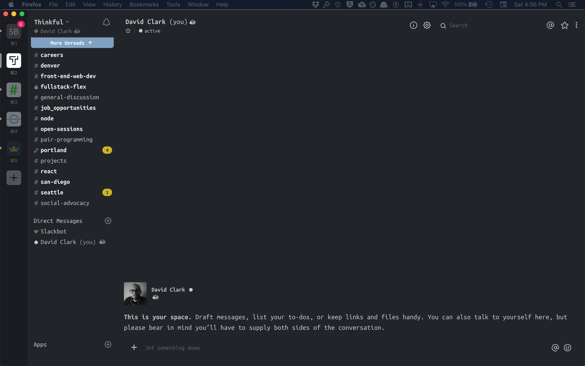

#How to Customize Slack
not just your sidebar

After lots and lots of searching, I have yet to find a reliable way to modify the appearance of the Slack client. There are several methods out there for hacking the Slack client into submission, but instructions on how to do this are pretty sparse. I’ll be attempting to mend that.

First of all, a **Disclaimer**: The changes you make will not persists between startups. That said, it’s a very simple copy/paste each time you open Slack. This would be a great script project (say, with Mac’s Automator), but I’ve not dived far into that yet.

Let’s get this started.

##What You'll Need

- Text Editor such as VS Code, Sublime, Atom, etc.
- GitHub or other version control service account
- Slack

##Here we go...

1. In Finder, select **Go > Go to Folder…**

2. Paste this into the field: `/Applications/Slack/Contents/Resources/app.asar.unpacked/src/static`

3. Here, open the `styles.css` file. Copy everything here or copy the file to new a `styles.css` file. Save this file to wherever you keep your coding projects, as we’re going to be pushing this up to GitHub.

4. Launch Slack

5. Open a Direct Message to yourself. This gives you a cleaner slate to work with later.

6. Type `/slackdevtools` into your message field. If this doesn’t work for you, you may need to instead download this [Hackable Slack Client](https://github.com/bighappyworld/slack-dev-tools) and type `cmd+alt+i`.

7. A Chrome DevTools interface will appear. Use the element selector, mouse over and click the element you’d like to change.

8. After selecting an element, view the **Computed** tab in the DevTools. This makes it easier to find what you’re looking for. If you don’t see the attribute you’re looking to change, keep going up to the next parent element until you find it. For the most part, we’re looking for `background-color`, `font-family`, and `border-color` to start with.

9. Once you find what you’re looking for under the **Computed** tab, hover your mouse over the attribute and click the arrow next to the value (a color, for instance). This takes you to the specific selector that you need to modify, under the **Styles** tab.

10. You can utilize the checkbox to toggle this selector on and off, allowing you to see in real-time the effects it has (I’ve noticed this doesn’t always work as expected). Also, make your change here to make sure it works.

11. If you’ve determined you’ve got the right selector, copy the class or id name.

12. Inside your new file, find that first element you want to change by using your text editor’s find feature. Typically the shortcut for this is `cmd+f`. Make the change you want. Try to make this first change super obvious, such as setting the `background-color` of `.p-channel_sidebar` class to `red`.

This is what you’ll do for every change you’d like to make. After you’ve made a change, you need to get your Slack client to see that change. It’s not going to see this file you’ve created.

What you want to do, is push this file up to GitHub. Once you’ve done that, copy the `styles.css` file’s link. Now, go to [Staticaly](https://www.staticaly.com/). Normally, I would recommend RawGit, but they are shutting down. :( Once at Staticaly, simply paste the link of your file and you’ll get a Staticaly CDN link with no limits. Copy that link.

**NOTE:** The reason we can’t just use our GitHub link is because we will run into a CORS error which we cannot fix (to my knowledge). Even if we can, this is a much quicker fix.

Now, remember how I said it wasn’t possible for your changes to persist between client restarts?

Here comes the workaround.

Every time you launch Slack, you’ll do the following:

1. Type `/slackdevtools` into your message field.

2. Once the DevTools come up, go to the Console tab.

3. Paste the following:

```
var cssURI = 'Staticaly URL';

$.get(cssURI).then(function(css) {
    $('<style />').text(css).appendTo('body')
});
```

##Wrap up

If you’d like to use the theme I created, picture above, use this:

```
var cssURI = 'https://cdn.staticaly.com/gh/DavidDoes/slack-full-client-custom-css/ea0a72fc/styles.css';

$.get(cssURI).then(function(css) {
    $('<style />').text(css).appendTo('body')
});
```

This theme is a darker imitation of the [Nord theme for VS Code by arcticicestudio](http://arcticicestudio.nord-visual-studio-code/). The reason for it being darker… I’m not sure. I used Mac’s **Digital Color Meter** to grab color values of my VS Code editor with the Nord theme enabled.

You can view [my theme’s CSS here](https://github.com/DavidDoes/slack-full-client-custom-css).
